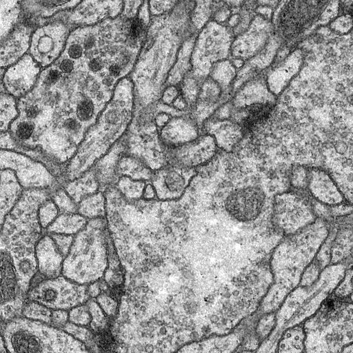
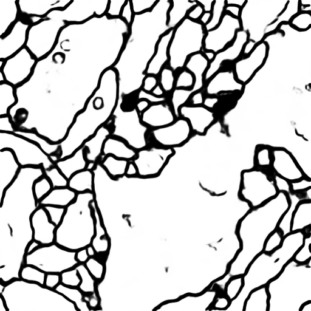

The architecture was inspired by [U-Net: Convolutional Networks for Biomedical Image Segmentation](http://lmb.informatik.uni-freiburg.de/people/ronneber/u-net/).

---

## Overview

### Data

The original dataset is from [isbi challenge](http://brainiac2.mit.edu/isbi_challenge/), and I've downloaded it and done the pre-processing.

You can find it in folder data/membrane.

### Data augmentation

The data for training contains 30 512*512 images, which are far not enough to feed a deep learning neural network. I use a module called ImageDataGenerator in keras.preprocessing.image to do data augmentation.

See dataPrepare.ipynb and data.py for detail.

### Model

This deep neural network is implemented with Keras functional API, which makes it extremely easy to experiment with different interesting architectures.

Output from the network is a 512*512 which represents mask that should be learned. Sigmoid activation function
makes sure that mask pixels are in \[0, 1\] range.

### Training

The model is trained for 5 epochs.

After 5 epochs, calculated accuracy is about 0.97.

Loss function for the training is basically just a binary crossentropy.

---

## How to use

# Run main.py

You will see the predicted results of test image in data/membrane/test

### Or follow notebook trainUnet

### Results

Use the trained model to do segmentation on test images, the result is statisfactory.

=======
